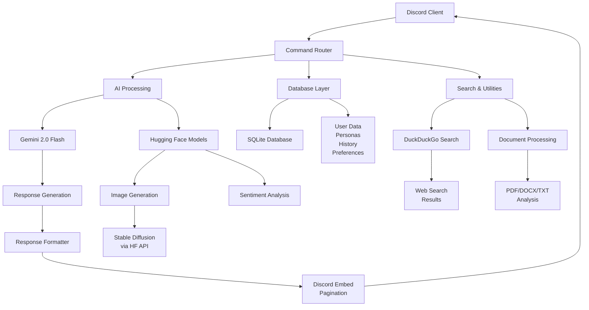

# Nemai Discord Bot

[](https://www.python.org/downloads/)

Nemai is a versatile, AI-powered Discord bot designed to enhance server engagement. Leveraging Google’s Gemini models and advanced natural language processing, Nemai offers a rich set of features including contextual conversations, custom personas, web search, document analysis, image generation, interactive storytelling, and personalized recommendations.

## 📌 Key Features

### 💬 AI Conversations

- `/chat [message]` — Engage in a general conversation with Nemai.
- `/sherlock [message]` — Get deductions from Sherlock Holmes.
- `/teacher [message]` — Receive simplified explanations from a teacher persona.
- `/scientist [message]` — Discuss topics with a knowledgeable scientist.

**✨ Special Request Recognition (within `/chat`, `/teacher`, and `/scientist`):**

- Definitions (e.g. `define photosynthesis`)
- Comparisons (e.g. `compare Python and JavaScript`)
- Citations (e.g. `find a citation for quantum entanglement`)
- Pros & Cons (e.g. `pros and cons of electric cars`)

### 🎭 Custom Personas (`/persona ...`)

- `create [name] [description]` — Create a unique AI persona (up to 5 per user).
- `activate [slot_id]` — Set one of your personas as active.
- `chat [message]` — Chat with your active persona.
- `debate [slot1] [slot2] [topic]` — Simulate a debate between two personas.
- `list` — View your created personas.
- `info [slot_id]` — View details and the prompt for a persona.
- `delete [slot_id]` — Remove a persona.

### 🌐 Web & Utility Commands

- `/search [query]` — Search the web via DuckDuckGo and receive AI-summarized results.
- `/news [topic]` — Get recent AI-summarized headlines by topic or general.
- `/factcheck [statement]` — Verify statements using AI-assisted web searches.
- `/explain_like_im [topic] [audience]` — Explain a topic tailored to a specific audience.
- `/summarize [text_or_url]` — Summarize text or webpage content.
- `/recipe [dish_name]` — Find a recipe using web search context.

### 📄 File & Document Assistance

- `/analyze_file [file] [prompt]` — Analyze uploaded images (JPG, PNG, WEBP, GIF) or text documents (PDF, DOCX, TXT, JSON, code files).
- `/doc_assist analyze [type] [file]` — Initial analysis for resumes, cover letters, essays, or reports.
- `/doc_assist critique [file] [focus]` — Targeted feedback (clarity, grammar, impact, conciseness).
- `/doc_assist rewrite_section [file] [goal] [section_text]` — Rewrite text to improve professionalism, conciseness, or engagement.

### ⭐ Recommendation Engine

- `set_preference [type] [likes] [dislikes]` — Store your media preferences.
- `get [type] [genre] [based_on]` — Get personalized recommendations.

### 📖 Interactive Story Generator

- `start [mode] [genre] [setting]`  
  - Collaborative: Take turns writing a story with the AI.
  - Choose Your Own: AI presents choices to shape the narrative.
- `continue [your_turn]` — Add your part in Collaborative mode.
- `status` — View your active story.
- `end` — Finish the story.

### 🎨 Image Generation

- `/imagine [prompt]` — Generate an image using Stable Diffusion via Hugging Face API.

### 🔧 History & Account Management

- `/search_history [query] [limit]` — Search your past messages.
- `/stats` — View your usage statistics.
- `/sentiment_stats [type] [limit]` — Analyze recent message sentiment.
- `/reset [type]` — Clear your conversation history.
- `/export [type] [limit]` — Export message history.
- `/help` — List all available commands.

### 🧠 Advanced Features

- Contextual Awareness — Uses recent and semantically relevant history for smarter replies.
- Feedback Loop — Learns from your 👍/👎 feedback to improve future interactions.
- Semantic Search — Uses Sentence Transformer embeddings for relevance-based history searches.
- Pagination — Neatly paginates long AI responses with embeds.
- Error Handling — Provides clear, informative error messages.

## 🛠️ Architecture & Workflow

### 📊 High-Level Architecture



### 🔄 Command Processing Flow Example (`/chat`)

User sends /chat → Discord forwards to bot → 
Bot defers response → Embedding generated → 
Message saved → Relevant history fetched → 
Gemini AI classifies and generates response → 
Response saved → Sent back to user with feedback options

## 📦 Technology Stack

- Python 3.10+
- discord.py 2.5.2
- Google Generative AI (Gemini 1.5 Flash)
- Sentence Transformers (all-MiniLM-L6-v2)
- Hugging Face Transformers (for sentiment analysis)
- Hugging Face Inference API (image generation)
- SQLite 3
- DuckDuckGo Search (duckduckgo-search)
- aiohttp
- PyPDF2
- python-docx
- python-dotenv

See `requirements.txt` for exact versions.

## 🖥️ Installation & Setup

1. Clone the repository

```
git clone https://github.com/ulviX/Nemai-Bot
cd Nemai-Bot
```

2. Create and activate a virtual environment

**Linux/macOS:**

```
python3 -m venv venv
source venv/bin/activate
```

**Windows:**

```
python -m venv venv
venv/Scripts/activate
```

3. Install dependencies

```
pip install -r requirements.txt
```

## ⚙️ Configuration

The `.env` file stores credentials and settings:

- `DISCORD_TOKEN`
- `GEMINI_API_KEY`
- `HUGGINGFACE_TOKEN`
- `ADMIN_USER_ID`

Pre-configured for evaluation.

## 🚀 Running the Bot

```
python main.py
```

The bot will sync commands and go live. Check the console for logs.

## 📖 Example Usage

```
/chat message: Hi. How are you doing?
/persona create name: Pirate description: Swashbuckling pirate persona
/persona chat message: Tell me a sea shanty!
/search query: latest renewable energy news
/analyze_file file: [your_file.pdf] prompt: Summarize the findings
/imagine prompt: A cat astronaut floating in space
/story start mode: Choose Your Own genre: Fantasy setting: Enchanted library
```

Use `help` for a full command list inside Discord.