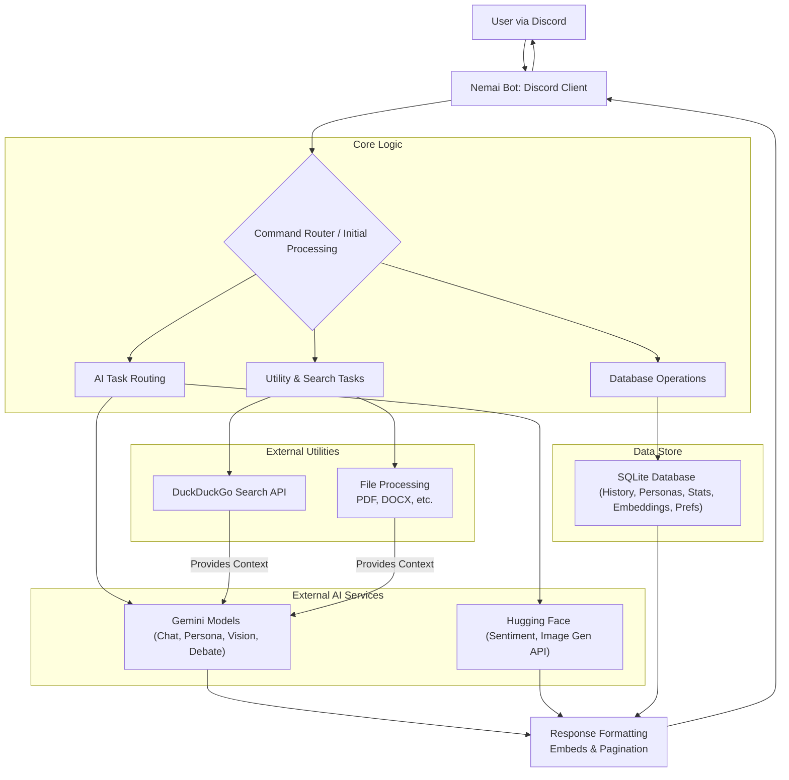

# Nemai Discord Bot

[](https://www.python.org/downloads/)

Nemai is a versatile, AI-powered Discord bot designed to enhance server engagement. Leveraging Google’s Gemini models and advanced natural language processing, Nemai offers a rich set of features including contextual conversations, custom personas, web search, document analysis, image generation, interactive storytelling, and personalized recommendations.

## üìå Key Features

### 💬 AI Conversations

- `/chat [message]` — Engage in a general conversation with Nemai.
- `/sherlock [message]` — Get deductions from Sherlock Holmes.
- `/teacher [message]` — Receive simplified explanations from a teacher persona.
- `/scientist [message]` — Discuss topics with a knowledgeable scientist.

**‚ú® Special Request Recognition (within `/chat`, `/teacher`, and `/scientist`):**

- Definitions (e.g. `define photosynthesis`)
- Comparisons (e.g. `compare Python and JavaScript`)
- Citations (e.g. `find a citation for quantum entanglement`)
- Pros & Cons (e.g. `pros and cons of electric cars`)

### üé≠ Custom Personas (`/persona ...`)

- `create [name] [description]` — Create a unique AI persona (up to 5 per user).
- `activate [slot_id]` — Set one of your personas as active.
- `chat [message]` — Chat with your active persona.
- `debate [slot1] [slot2] [topic]` — Simulate a debate between two personas.
- `list` — View your created personas.
- `info [slot_id]` — View details and the prompt for a persona.
- `delete [slot_id]` — Remove a persona.

### üåê Web & Utility Commands

- `/search [query]` — Search the web via DuckDuckGo and receive AI-summarized results.
- `/news [topic]` — Get recent AI-summarized headlines by topic or general.
- `/factcheck [statement]` — Verify statements using AI-assisted web searches.
- `/explain_like_im [topic] [audience]` — Explain a topic tailored to a specific audience.
- `/summarize [text_or_url]` — Summarize text or webpage content.
- `/recipe [dish_name]` — Find a recipe using web search context.

### 📄 File & Document Assistance

- `/analyze_file [file] [prompt]` — Analyze uploaded images (JPG, PNG, WEBP, GIF) or text documents (PDF, DOCX, TXT, JSON, code files).
- `/doc_assist analyze [type] [file]` — Initial analysis for resumes, cover letters, essays, or reports.
- `/doc_assist critique [file] [focus]` — Targeted feedback (clarity, grammar, impact, conciseness).
- `/doc_assist rewrite_section [file] [goal] [section_text]` — Rewrite text to improve professionalism, conciseness, or engagement.

### ⭐ Recommendation Engine

- `set_preference [type] [likes] [dislikes]` — Store your media preferences.
- `get [type] [genre] [based_on]` — Get personalized recommendations.

### üìñ Interactive Story Generator

- `start [mode] [genre] [setting]`  
  - Collaborative: Take turns writing a story with the AI.
  - Choose Your Own: AI presents choices to shape the narrative.
- `continue [your_turn]` — Add your part in Collaborative mode.
- `status` — View your active story.
- `end` — Finish the story.

### üé® Image Generation

- `/imagine [prompt]` — Generate an image using Stable Diffusion via Hugging Face API.

### üîß History & Account Management

- `/search_history [query] [limit]` — Search your past messages.
- `/stats` — View your usage statistics.
- `/sentiment_stats [type] [limit]` — Analyze recent message sentiment.
- `/reset [type]` — Clear your conversation history.
- `/export [type] [limit]` — Export message history.
- `/help` — List all available commands.

### 🧠 Advanced Features

- Contextual Awareness — Uses recent and semantically relevant history for smarter replies.
- Feedback Loop — Learns from your 👍/👎 feedback to improve future interactions.
- Semantic Search — Uses Sentence Transformer embeddings for relevance-based history searches.
- Pagination — Neatly paginates long AI responses with embeds.
- Error Handling — Provides clear, informative error messages.

## 🛠️ Architecture & Workflow

### üìä High-Level Architecture


```mermaid
graph TD
    A[User via Discord] --> B[Nemai Bot: Discord Client]
    B --> C{Command Router / Initial Processing}

    subgraph Core Logic
        C --> D[AI Task Routing]
        C --> E[Database Operations]
        C --> F[Utility & Search Tasks]
    end

    subgraph External AI Services
        D --> G["Gemini Models <br/>(Chat, Persona, Vision, Debate)"]
        D --> H["Hugging Face <br/>(Sentiment, Image Gen API)"]
    end

    subgraph Data Store
        E --> I["SQLite Database <br/>(History, Personas, Stats, Embeddings, Prefs)"]
    end

    subgraph External Utilities
        F --> J[DuckDuckGo Search API]
        F --> K[File Processing <br/>PDF, DOCX, etc.]
    end

    %% Results feed into Response Formatting
    G --> L["Response Formatting <br/>Embeds & Pagination"]
    H --> L
    I --> L

    %% Utilities context flow
    J -->|Provides Context| G
    K -->|Provides Context| G

    %% Final response path
    L --> B
    B --> A
```

### 🔄 Command Processing Flow Example (`/chat`)

User sends /chat ‚Üí Discord forwards to bot ‚Üí 
Bot defers response ‚Üí Embedding generated ‚Üí 
Message saved ‚Üí Relevant history fetched ‚Üí 
Gemini AI classifies and generates response ‚Üí 
Response saved ‚Üí Sent back to user with feedback options

## 📦 Technology Stack

- Python 3.10+
- discord.py 2.5.2
- Google Generative AI (Gemini 1.5 Flash)
- Sentence Transformers (all-MiniLM-L6-v2)
- Hugging Face Transformers (for sentiment analysis)
- Hugging Face Inference API (image generation)
- SQLite 3
- DuckDuckGo Search (duckduckgo-search)
- aiohttp
- PyPDF2
- python-docx
- python-dotenv

See `requirements.txt` for exact versions.

## 🖥️ Installation & Setup

1. Clone the repository

```
git clone https://github.com/ulviX/Nemai-Bot
cd Nemai-Bot
```

2. Create and activate a virtual environment

**Linux/macOS:**

```
python3 -m venv venv
source venv/bin/activate
```

**Windows:**

```
python -m venv venv
venv/Scripts/activate
```

3. Install dependencies

```
pip install -r requirements.txt
```
Fallback method to download required libraries
```
pip install discord.py google-generativeai transformers sentence-transformers torch numpy duckduckgo-search aiohttp PyPDF2 python-docx python-dotenv
```
## ⚙️ Configuration

The `.env` file stores credentials and settings:

- `DISCORD_TOKEN`
- `GEMINI_API_KEY`
- `HUGGINGFACE_TOKEN`
- `ADMIN_USER_ID`

Pre-configured for evaluation.

## üöÄ Running the Bot

```
python main.py
```

The bot will sync commands and go live. Check the console for logs.

## üìñ Example Usage

```
/chat message: Hi. How are you doing?
/persona create name: Pirate description: Swashbuckling pirate persona
/persona chat message: Tell me a sea shanty!
/search query: latest renewable energy news
/analyze_file file: [your_file.pdf] prompt: Summarize the findings
/imagine prompt: A cat astronaut floating in space
/story start mode: Choose Your Own genre: Fantasy setting: Enchanted library
```

Use `help` for a full command list inside Discord.